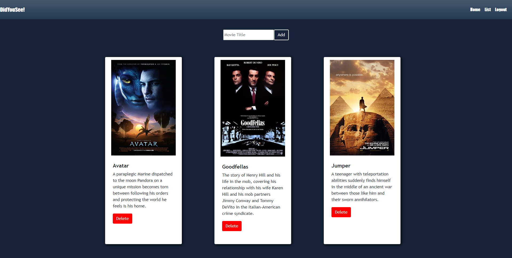

# Did-You-See
  
  
  ## Description
  --- 
  This application allows users to create lists of their favorite movies. 
  
  ## Table of Contents
  ---
  * [Installation](#installation)
  * [Usage](#usage)
  * [Contribution](#contribution)
  * [Technologies](#technologies)
  * [Team](#team)
  * [Images](#images)
  * [Application](#application)
  
  ## Installation
  ---
  None (See Application)
  
  ## Usage
  ---
  Create an account, then search for movies to add to your list.
  
  ## Contribution
  ---
  Anyone can contribute
  
  ## Technologies
  ---
  * 
<a href ="http://www.omdbapi.com/">The Open Movie Database API</a>

  * 
<a href = "https://www.npmjs.com/package/axios">axios</a>

  * 
<a href = "https://www.npmjs.com/package/bcrypt">bcrypt</a>

  * 
<a href = "https://www.npmjs.com/package/connect-session-sequelize">connect-session-sequelize</a>

  * 
<a href = "https://www.npmjs.com/package/dotenv">dotenv (add license)</a>

  * 
<a href = "https://www.npmjs.com/package/express">express</a>

  * 
<a href = "https://www.npmjs.com/package/express-handlebars">express-handlebars (add license)</a>

  * 
<a href = "https://www.npmjs.com/package/express-session">express-session</a>

  * 
<a href = "https://www.npmjs.com/package/handlebars">handlebars</a>

  * 
<a href = "https://www.npmjs.com/package/mysql2">mysql2</a>

  * 
<a href = "https://www.npmjs.com/package/nodemailer">nodemailer</a>

  * 
<a href = "https://www.npmjs.com/package/sequelize">sequelize</a>

  * 
<a href = "https://www.npmjs.com/package/prettier">prettier</a>

  * 
<a href = "https://getbootstrap.com/">bootstrap</a>

  * 
<a href = "https://jquery.com/">jquery</a>

  

  ## Team
  ---
  
Matthew Arnett: <a href = "https://github.com/MA15">MA15</a>

  
Sean Elliott: <a href = "https://github.com/sean-elliott-97">sean-elliott-97</a>

  
Antonia Garcia: <a href = "https://github.com/Iviviana">Iviviana</a>

  ## Images
  ---
  
<strong>HomePage Screenshot</strong>

  
  
<strong>List Screenshot</strong>

  
  
<strong>Individual Movie Screenshot</strong>

  
  
<strong>Login and Sign Up Screenshot</strong>

  

  ## Application
  ---
  
Click to view application: <a href="https://did-you-see.herokuapp.com/">Did-You-See</a>
